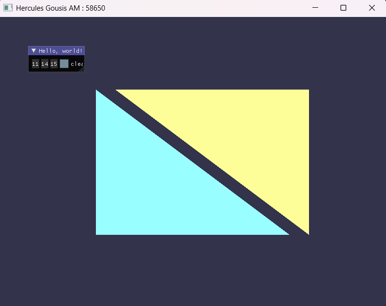
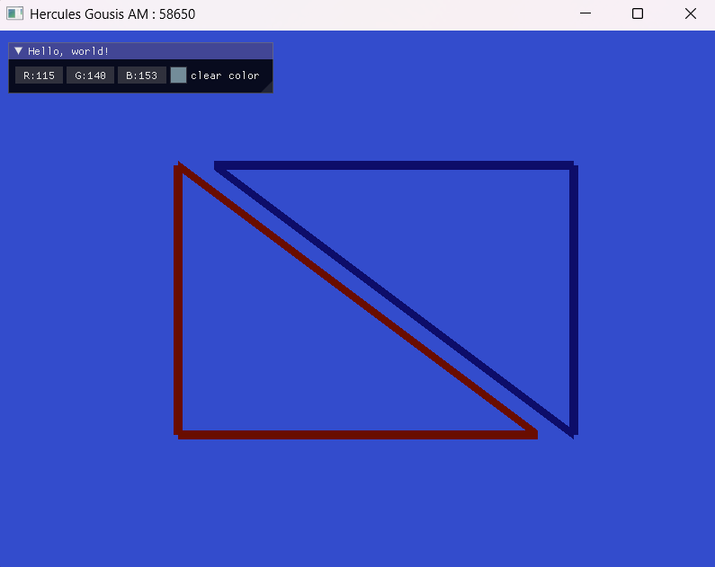
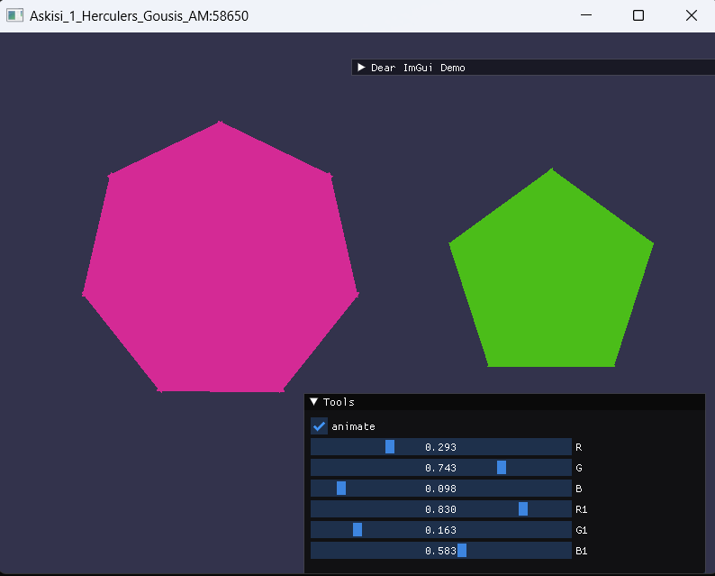
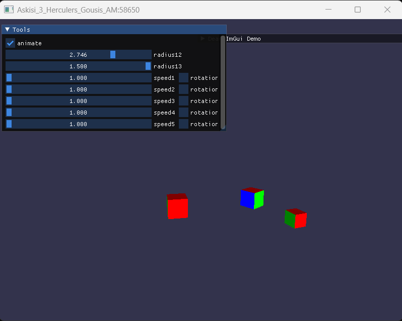
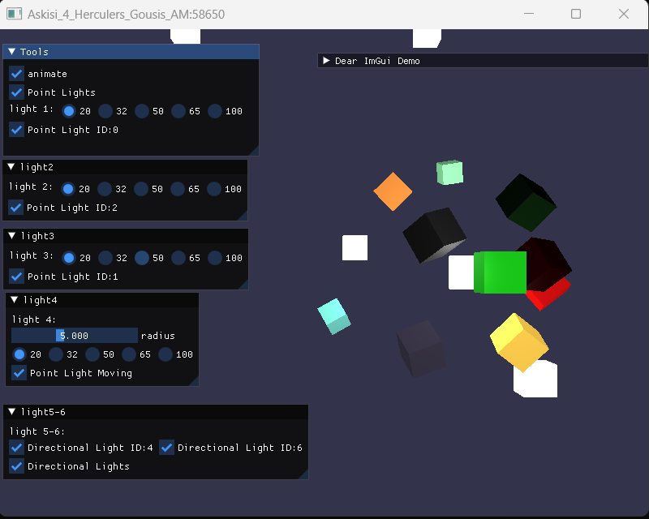
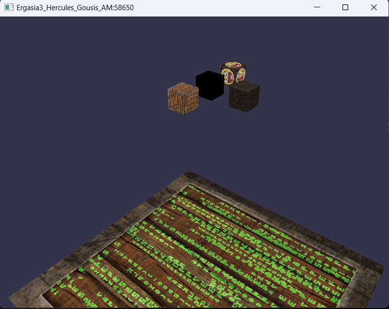
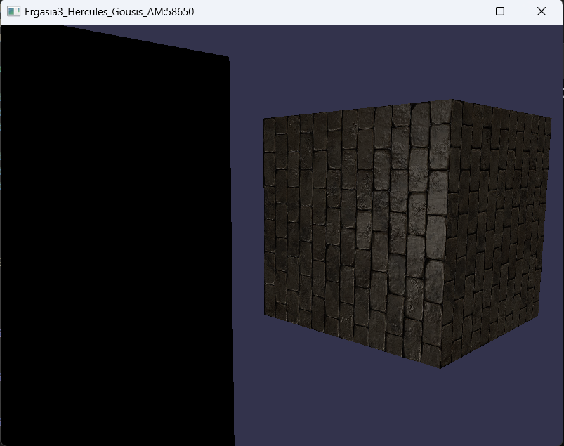
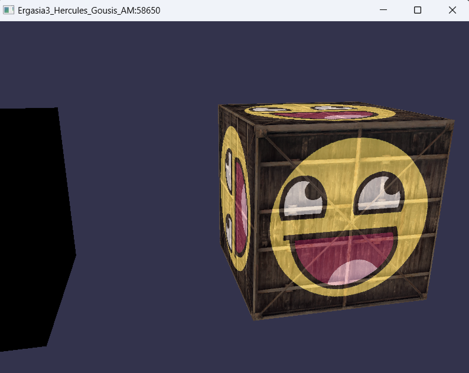
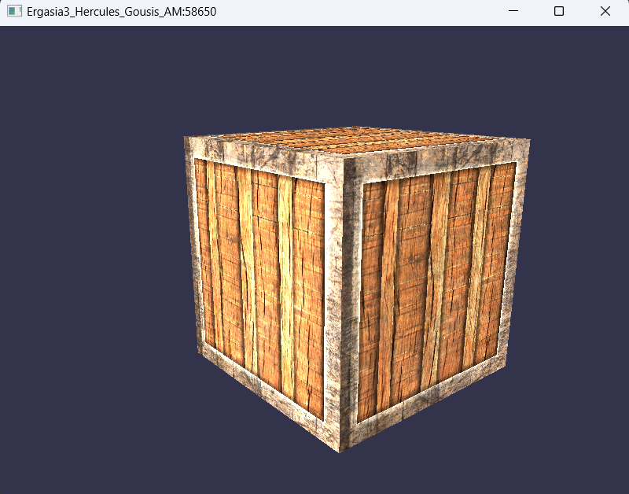
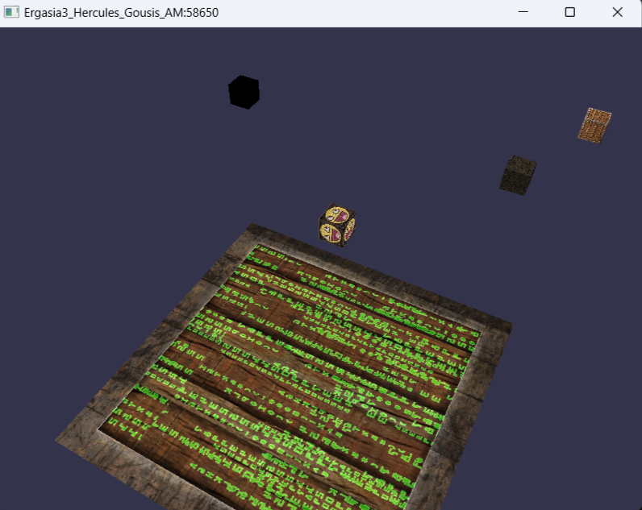

# Graphics_OpenGL
## Home_2D
Δημιουργία ενός σπιτιού σε 2D διαστάσεις στην γλωσσά προγραμματισμού  C++  και εναλλαγή χρώματος του background.
<div style="text-align:center;">
    
</div>

* Για Windows

Κατεβαζεις το  Visual Studio 2022 φτιαχνεις ενα περιββαλον και βαζεις και τον φακελο ```Dependencies```


* Για Linux (Ubuntu 22.04)

Στο τερματικο γραφω 

```shell
g++ code.cpp imgui/*.cpp imgui/backends/imgui_impl_glfw.cpp imgui/backends/imgui_impl_opengl3.cpp
-Iimgui -Iimgui/backends -o home_2d -lglfw -lGL -lGLEW

```

και μετα 

```shell
./home_2d
```

## Ergasia_1
Η εκφωνηση της εργασιας ειναι εδω [εργασια_1.pdf]( )

<div style="text-align:center;">
    
</div>

<div style="text-align:center;">
    
</div>

* Για Windows

Κατεβαζεις το  Visual Studio 2022 φτιαχνεις ενα περιββαλον και βαζεις και τον φακελο ```Dependencies```

## Ergasia_2
Η εκφωνηση της εργασιας ειναι εδω [εργασια_2.pdf]( )
2. Παρακάτω υπάρχουν είκονες απο τα αποτελέσματα των ασκήσεων :

<div style="text-align:center;">
    
</div>

<div style="text-align:center;">
    
</div>

<div style="text-align:center;">
    
</div>

## Notes
Όλες οι ασκήσεις ολοκληρώθηκαν εκτός από την 4η λόγω έλειψης χρόνου. ’πο την άσκηση 4 δεν έγινε με σωστό τρόπο η κινούμενη σημειακή πηγή και η αλληλεπίδραση με το τον δεικτη ποντικιού όταν ειναι πατημένο το Left Ctrl   .
* Για Windows

Κατεβαζεις το  Visual Studio 2022 φτιαχνεις ενα περιββαλον και βαζεις και τον φακελο ```Dependencies```

* Για Linux (Ubuntu 22.04)

Στο τερματικο γραφω 

```shell
g++ Ask1_58650.cpp imgui/*.cpp imgui/backends/imgui_impl_glfw.cpp imgui/backends/imgui_impl_opengl3.cpp -Iimgui -Iimgui/backends -I/usr/include -o ask1 -lglfw -lGL -lGLEW
```
και μετα 
```shell
./ask1
```

### Σημειωση
στο αρχειο ```Shader.h```
```
#include <GL/glew.h>
```
στο αρχειο ```Ask1_58650.cpp```
```
#include "imgui/imgui.h"
#include "imgui/backends/imgui_impl_glfw.h"
#include "imgui/backends/imgui_impl_opengl3.h"
#include "Shader.h"
```
Για την ασκηση 2 
```shell
g++ Ask2_58650.cpp imgui/*.cpp imgui/backends/imgui_impl_glfw.cpp imgui/backends/imgui_impl_opengl3.cpp -Iimgui -Iimgui/backends -I/usr/include -o ask2 -lglfw -lGL -lGLEW
```

στο αρχειο ```Ask2_58650.cpp```
```
#include "imgui/imgui.h"
#include "imgui/backends/imgui_impl_glfw.h"
#include "imgui/backends/imgui_impl_opengl3.h"
#include "Shader.h"
```
και μετα 

```shell
./ask2
```

Για την ασκηση 3 
```shell
g++ Ask3_58650.cpp imgui/*.cpp imgui/backends/imgui_impl_glfw.cpp imgui/backends/imgui_impl_opengl3.cpp -Iimgui -Iimgui/backends -I/usr/include -o ask3 -lglfw -lGL -lGLEW
```

στο αρχειο ```Ask3_58650.cpp```
```
#include "imgui/imgui.h"
#include "imgui/backends/imgui_impl_glfw.h"
#include "imgui/backends/imgui_impl_opengl3.h"
#include "Shader.h"
```
και μετα 

```shell
./ask3
```

Για την ασκηση 4

```shell
g++ Ask4_58650.cpp imgui/*.cpp imgui/backends/imgui_impl_glfw.cpp imgui/backends/imgui_impl_opengl3.cpp -Iimgui -Iimgui/backends -I/usr/include -o ask4 -lglfw -lGL -lGLEW
```

στο αρχειο ```Ask4_58650.cpp```
```
#include "imgui/imgui.h"
#include "imgui/backends/imgui_impl_glfw.h"
#include "imgui/backends/imgui_impl_opengl3.h"
#include "Shader.h"
```
και μετα 

```shell
./ask4
```

## Ergasia_3
Η εκφωνηση της εργασιας ειναι εδω [εργασια_3.pdf]( )
2. Σχετικά με την τυχαία θέση η εκφώνηση έλεγε από -15 έως 15 . Επειδή οι κύβοι έπεφταν στο κενό θεώρησα ότι είναι από -10 έως 10 όπως είναι και η διάσταση του δαπέδου. Για -15 έως 15 έχω βάλει σχόλιο την εντολή που χρειάζεται.

3. Έχω βάλει επιπλέον σε λειτουργιά τα πλήκτρα WSAD για κίνηση για να δείτε τους κύβους από κοντά. Έχω βάλει και σε σχόλιο και μια θέση σταθερή .

4. Κάθε φορά που πατάμε το πλήκτρο UP και DOWN αυξάνεται ή μειώνεται η ταχύτητα . Για να φτάσετε στο όριο πατήστε πολλες φορές τα πλήκτρα  UP ή  DOWN.

5. Παρακάτω υπάρχουν είκονες απο το αποτελέσμα της ασκήσης :

<div style="text-align:center;">
    
</div>

<div style="text-align:center;">
    
</div>

<div style="text-align:center;">
    
</div>

<div style="text-align:center;">
    
</div>

<div style="text-align:center;">
    
</div>

*  Για Windows

Κατεβαζεις το  Visual Studio 2022 φτιαχνεις ενα περιββαλον και βαζεις και τον φακελο ```Dependencies```

* Για Linux (Ubuntu 22.04)

Στο τερματικο γραφω 

```shell
g++ 58650.cpp -I/usr/include -I/path/to/stb_image -o 58650 -lglfw -lGL -lGLEW -lX11 -lpthread -lGLU
```
στο αρχειο ```58650.cpp ```
```
#include <GL/glew.h>
#include <GLFW/glfw3.h>
#include <iostream>
#include "Shader.h"
#include <glm/glm.hpp>
#include <glm/gtc/matrix_transform.hpp>
#include <glm/gtc/type_ptr.hpp>
#include "Camera.h"
#define STB_IMAGE_IMPLEMENTATION
#include "stb_image/stb_image.h"
#include <cmath> 
```
και 
```
./58650
```